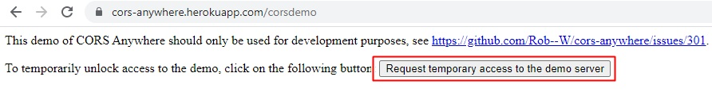
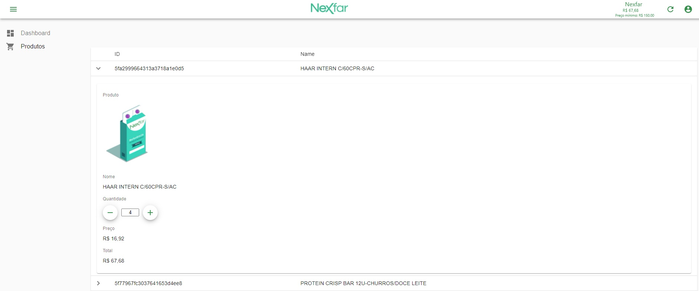

## Projeto Carrinho de Compras [DEMO]

## Desafios iniciais

- Efetuar a conversação de valores entre componentes pais e filhos que foi sanada utilizando context api e hooks de renderização
- Efetuar a persistência dos dados utilizando localStorage

## Maneiras de melhoria

- Utilização do React Admin que é um framework open-source fornecendo uma estrutura pré estabelecida para roteamento das pages, hierarquia de props e suporte web/mobile.

## Acessar a URL:

`https://cors-anywhere.herokuapp.com`

<label>Clique no botão marcado para habilitar temporariamente a tratativa do CORS</label>

<h1 align="center">
 
  
 
</h1>

## Script RUN inicial

### `yarn start`

<h1 align="center">
 
  
 
</h1>

## 🚀 Technologies

This project was developed with the following technologies:

- ✔️ React

- ✔️ React Admin

- ✔️ styled-components

- ✔️ Context API

- ✔️ fetchUtils
